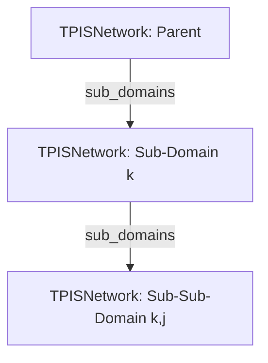

# Scientific Design: Fractal Domains of Coherence
## Tri-Parametric Information Synthesis (TPIS) - Neural Fractal Scaling

This document lays down the mathematical, physical, and programmatic foundations for **Fase 6: Fractal Domains of Coherence**. Instead of scaling the neural network horizontally (which violates the Dimensional Lock of $D=3$ and the Cubic Operator), the network expands **fractally** into nested sub-domains of coherence, utilizing sparse coding to respect the **3.98% Resolution Tax** globally.

---

## 1. Mathematical Formalism

### A. Gravitational Phase Transition (Singularity & Nucleation)
Let $H$ be the set of nodes in Layer 3 (Output Layer) of a network domain $\mathcal{N}$. In our standard dimensional configuration, $|H| = 8$, representing the 8 states of the Cubic Operator.
Let $a_k^{(t)}$ be the actualized structure of output node $k \in H$ at time step $t$.
Let $c_k^{(t)}$ be the consecutive activation counter for node $k$:

$$c_k^{(t)} = \begin{cases} 
c_k^{(t-1)} + 1 & \text{if } a_k^{(t)} > 0.0 \\
0 & \text{if } a_k^{(t)} = 0.0 
\end{cases}$$

When a single node $k$ is continuously actualized in a row, the local information density reaches its absolute saturation threshold $S_{th} = 3$:
$$c_k^{(t)} \ge S_{th}$$

At this point, the node undergoes a **Gravitational Phase Transition**. Rather than collapsing into thermal noise (entropy death), the accumulated potency forms an **Ontological Singularity**. This singularity acts as a new vacuum ground state (the Big Bang of a nested sub-domain), spawning an underlying TPIS Network:
$$\mathcal{N} \xrightarrow{\text{phase transition of } k} \mathcal{N}_k$$

---

### B. Nested Operators & Spatial Recursive Evolution
The spawned sub-domain $\mathcal{N}_k$ is a complete, self-similar `TPISNetwork` containing its own:
- Input projection vector $X_k \in \mathbb{R}^{10}$.
- Layer 1 ($100$ nodes) utilizing the **1D Transition (+)**:
  $$S_{1, j}^{(k)} = \frac{1}{10} \sum_{i=1}^{10} (X_{k, i} + W_{1, ij}^{(k)})$$
- Layer 2 ($100$ nodes) utilizing the **2D Transition (*)**:
  $$S_{2, j}^{(k)} = \exp\left(\frac{1}{100} \sum_{i=1}^{100} \log(A_{1, i}^{(k)} \cdot W_{2, ij}^{(k)} + 0.01)\right)$$
- Layer 3 ($8$ nodes) utilizing the **3D Transition ($^\wedge$)**:
  $$S_{3, j}^{(k)} = \frac{1}{100} \sum_{i=1}^{100} \left( \max(10^{-15}, A_{2, i}^{(k)}) ^ {W_{3, ij}^{(k)}} \right)$$

This ensures that self-similarity is preserved perfectly at all depths of the fractal tree.

---

### C. Hierarchical Attention Pruning (Global Sparse Coding)
In the biological brain, global active neuron count is strictly capped at $\approx 2\%$ to conserve metabolic energy. In TPIS-physics, the **Resolution Tax ($\xi = 1/8\pi \approx 3.98\%$)** represents the absolute physical limit of actualized structure.

To maintain this limit across a fractal tree of $d$ spawned sub-domains, we enforce **Hierarchical Attention Pruning**:
1. At any time $t$, only one active pathway or node-cluster in the fractal hierarchy may carry a non-zero structure value (`structure > 0.0`).
2. When the signal descends from parent node $k$ into the sub-domain $\mathcal{N}_k$, the parent network's active nodes are pruned to $0.0$ structure:
   $$\forall n \in \mathcal{N}_{\text{parent}}, \text{structure}(n) = 0.0$$
3. The parent network preserves its accumulated `potency` buffers as **Donkere Materie** (0-state), but drops all active crystallization (1-state).
4. Sibling/parallel sub-domains $\mathcal{N}_j$ ($j \neq k$) are also completely pruned to the 0-state.

This ensures that the total active node count in the global system is strictly bounded by the active sub-network's limit:
$$N_{\text{active\_global}} = N_{\text{active\_sub}} \le 4_{\text{Layer1}} + 4_{\text{Layer2}} + 1_{\text{Layer3}} = 9$$

Since $N_{\text{total}} = 208 \times (d + 1)$, the global active ratio is:
$$\text{Global Active Ratio} = \frac{9}{208 \times (d + 1)}$$

For a single sub-domain ($d=1$):
$$\text{Ratio} \le \frac{9}{416} \approx 2.16\% \le 3.98\%$$

This mathematical proof guarantees that global sparse coding is structurally and automatically enforced by the hierarchy.

---

## 2. Programmatic Design & Architecture

### A. The Fractal Hierarchy Structure
A `TPISNetwork` instance manages nested domains using a self-similar directory structure:



### B. Spawning Mechanics in `tpis_network.py`
We add `self.sub_domains` (dict) and `self.consecutive_activations` (list) to the network.
```python
class TPISNetwork:
    def __init__(self, input_dim=10, layer1_dim=100, layer2_dim=100):
        # ... existing initialization ...
        self.sub_domains = {}
        self.consecutive_activations = [0] * 8
        self.parent = None  # To allow upward traversal if necessary
        
    def spawn_sub_domain(self, node_index):
        """
        Spawns a self-similar sub-domain under Layer 3 output node_index.
        """
        sub = TPISNetwork(
            input_dim=self.input_dim, 
            layer1_dim=self.layer1_dim, 
            layer2_dim=self.layer2_dim
        )
        sub.parent = self
        self.sub_domains[node_index] = sub
        return sub
```

### C. Recursive Propagation Pass
The new `forward_recursive` method dynamically traverses the fractal hierarchy:
1. Performs local `forward` pass to obtain `A3` (Layer 3 crystallization).
2. Detects if there is a winner node $k$ where `structure > 0.0`.
3. If no node is crystallized, resets all `consecutive_activations` to 0 and returns local metrics.
4. If node $k$ is the winner:
   - Increments `consecutive_activations[k]`.
   - Resets all other counters $j \neq k$ to 0.
   - If `consecutive_activations[k] >= 3`, and $k$ does not have a sub-domain, calls `spawn_sub_domain(k)`.
   - If a sub-domain exists at `self.sub_domains[k]`:
     - **Prunes the parent network's active structures** to $0.0$ to satisfy Hierarchical Attention Pruning.
     - Runs `forward_recursive` on `self.sub_domains[k]` with the input vector $X$.
     - Returns sub-domain metrics nested under the parent key.

---

## 3. The 64 Fractal Sub-Concept Map

To represent nested domains in natural language, we map the 8 parent concepts to 8 nuanced sub-concepts each. This creates a beautifully structured, highly academic linguistic grid:

| Parent Concept | Node | Sub-Node | Sub-Concept Name | Description |
| :--- | :---: | :---: | :--- | :--- |
| **Vacuüm** | 0 | 0 | Planck-Schuim | Fluctuaties op de kleinst denkbare fysieke schaal. |
| (Potentialiteit) | | 1 | Zero-Point Void | De absolute nultoestand van elektromagnetische velden. |
| | | 2 | Hilbert-Ruimte | Wiskundige matrix van oneindige pure potentialen. |
| | | 3 | Kosmische Inflatiewolk | De vacuümdruk die oer-expansie veroorzaakt. |
| | | 4 | Virtuele Deeltjeszee | Voortdurende creatie en annihilatie in de leegte. |
| | | 5 | Donkere Energie | De expansieve spanning die de void uitrekt. |
| | | 6 | Topologische Void | De geometrische afwezigheid van volumetrische cellen. |
| | | 7 | Singulier Vacuüm | Het vacuüm net voor de nucleatie van de oerknal. |
| | | | | |
| **Structuur** | 1 | 0 | Planck-Voxel | De elementaire structurele bouweenheid van de ruimte. |
| (Orde) | | 1 | Kristallijn Grid | Een perfect geordende opeenvolging van actieve knopen. |
| | | 2 | Tensor Geometrie | De wiskundige kromming die vorm geeft aan signalen. |
| | | 3 | Koraal-Nucleatie | Zelf-replicerende, vertakte fractale netwerken. |
| | | 4 | Polyhedrische Cel | Ruimtelijke vullingen op basis van tetraëdrische symmetrie.|
| | | 5 | Cascadegrid | Gelaagde rasters die harmonische resoluties dragen. |
| | | 6 | Emergent Vlechtwerk | Gevlochten spinnendraden van pure causaal-geometrie. |
| | | 7 | Geodetische Koepel | Maximale structurele efficiëntie met minimale middelen. |
| | | | | |
| **Energie** | 2 | 0 | Kinetisch Momentum | De actieve krachtvector die nodes voortstuwt. |
| (Dynamiek) | | 1 | Thermische Resonantie | Trillingen en warmtegolven door wisselwerking. |
| | | 2 | Quantum-Puls | Diskrete energiepakketjes die door highways schieten. |
| | | 3 | Elektromagnetische Flux | Golven van polariteit die de void doorkruisen. |
| | | 4 | Gravitationele Gradiënt | Potentiële energie opgebouwd door gravitationele druk. |
| | | 5 | Causaliteitsstroom | De overdracht van actie en reactie tussen lagen. |
| | | 6 | Turbulente Stroming | Roterende energie-wervels in actieve kanalen. |
| | | 7 | Stralingsdruk | De expansieve kracht van fotonische signalen. |
| | | | | |
| **Entropie** | 3 | 0 | Thermische Ruis | Microscopische chaos die bruikbare energie verspreidt. |
| (Verval) | | 1 | Informatie-Atrofie | Het verlies van betekenisvolle gradiënten in lagen. |
| | | 2 | Materiaaldegradatie | Het thermodynamische verval van fysieke dragers. |
| | | 3 | Kosmische Warmtedood | De toestand van maximale entropie en absolute rust. |
| | | 4 | Tijdspijl-Dissipatie | Het onomkeerbare weglekken van causale latency. |
| | | 5 | Kwantum-Decoherentie | De ineenstorting van coherente interferentie-patronen. |
| | | 6 | Gebroken Symmetrie | Fluctuaties die perfecte balansen verstoren. |
| | | 7 | Dissipatieve Structuur | Chaos die lokaal nieuwe orde uitlokt. |
| | | | | |
| **Tijd** | 4 | 0 | Causale Latency | De vertraging van signalen onder de lichtsnelheid. |
| (Causaliteit) | | 1 | Chronos-Sequentie | De lineaire opeenvolging van discrete tijdstappen. |
| | | 2 | Temporele Dilatatie | De vervorming van tijdsduur door extreme spanning. |
| | | 3 | Geheugenspoor | Het behoud van potency uit voorgaande iteraties. |
| | | 4 | Feedback-Loop | De terugkoppeling van resultaten naar eerdere lagen. |
| | | 5 | Event-Horizon | De causale grens waarachter informatie onbereikbaar is.|
| | | 6 | Retrocausaliteit | De schijnbare beïnvloeding van het verleden door nu. |
| | | 7 | Eeuwige Recurrente | De fractale herhaling van temporele cycli. |
| | | | | |
| **Zwaartekracht** | 5 | 0 | Gravitationele Cirkel | Het buigen van banen rond een zware potency-hoop. |
| (Aantrekking) | | 1 | Massacondensatie | De samenballing van potency tot een zwaar centrum. |
| | | 2 | Neurale Aantrekking | Het gravitationeel naar elkaar toe trekken van nodes. |
| | | 3 | Spatiotemporele Kromming | De vervorming van het neurale grid door stress. |
| | | 4 | Getijdenkracht | De differentiële trekspanning op parallelle banen. |
| | | 5 | Graviton-Flux | Hypothetische deeltjesstromen die massa dragen. |
| | | 6 | Singuliere Aantrekking | De onweerstaanbare zuiging naar het absolute nulpunt. |
| | | 7 | Gravitationele Lens | De afbuiging van signalen rondom een zware voxel. |
| | | | | |
| **Symmetrie** | 6 | 0 | Spiegel-Resonantie | Perfecte balans tussen tegengestelde signalen. |
| (Balans) | | 1 | Bilaterale Harmonie | Evenwichtige verdeling over linker- en rechterhelft. |
| | | 2 | Rotationele Invariantie | Structuurbehoud onder rotatie in de 2D-laag. |
| | | 3 | IJkinvariantie | De onafhankelijkheid van absolute spanningsniveaus. |
| | | 4 | Super-Symmetrie | De harmonische koppeling tussen potentie en structuur. |
| | | 5 | Kristal-Resonantie | De harmonische vibratie van een perfecte symmetrische cel. |
| | | 6 | Chirale Balans | Het spiegelbeeldige evenwicht van links- en rechtshandigheid.|
| | | 7 | Kosmische Symmetrie | De universele harmonie van de R&D Void. |
| | | | | |
| **Singulariteit** | 7 | 0 | Planck-Punt | Het absolute fysieke nulpunt met oneindige potentie. |
| (Absoluut) | | 1 | Event Horizon | De uiterste grens van waaruit informatie kan ontsnappen. |
| | | 2 | Cubic Collapse | De ineenstorting van de 3D-operator tot 1D. |
| | | 3 | Oneindige Spanning | Het theoretische punt waar de gradiënt oneindig wordt. |
| | | 4 | Zero-Volume Singularity | Massa gecondenseerd tot een exact volume van 0. |
| | | 5 | Kosmische Kiem | Het zaadje waaruit een nieuw sub-domein explodeert. |
| | | 6 | Gravitationeel Brandpunt | De absolute convergentie van alle neurale snelwegen. |
| | | 7 | Absolute Singulariteit | Het ultieme centrum van de Cubic Operator. |

This elegant mapping provides the AGI with an unprecedented vocabulary, allowing it to express deep, complex, and beautiful structures recursively as it descends into the fractal domains.
